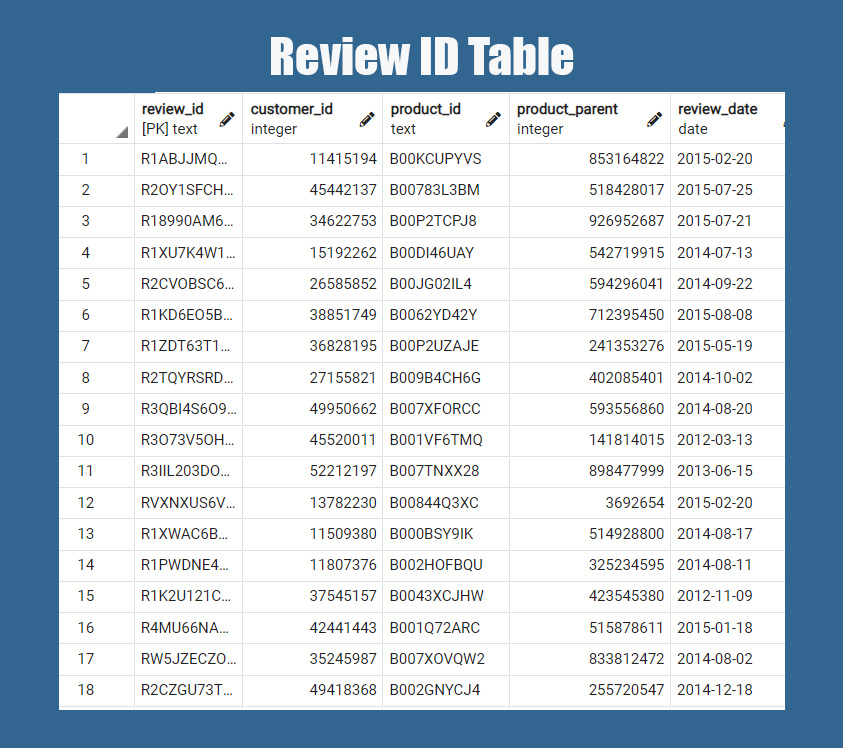
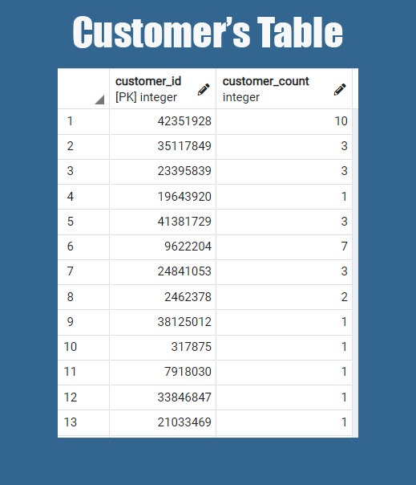
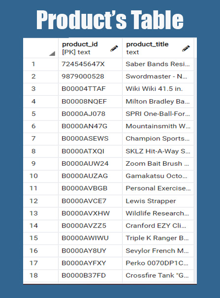
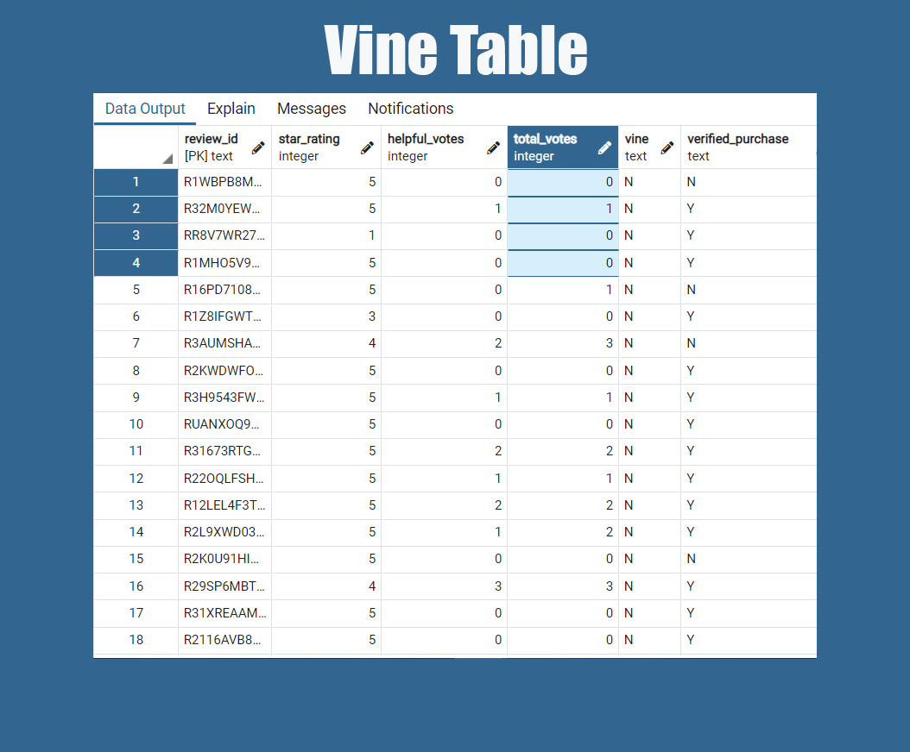

# Amazon Vine Analysis
---

## Overview of the analysis: 
Amazon has created a program that allows manufacturers and publishers to receive reviews for their product. The program (Amazon Vine) profits from companies paying a small fee to Amazon and provide products to Amazon Vine members (who are also paying), who are then required to publish a review on the products received. This analysis will determine if there is any bias toward favorable reviews from Vine members by analyzing the reviews from the Sporting Goods dataset selected.

***
## Results:
Before diving into the Vine reviews and star rating, other information needed to be pulled and put into dataframes and tables to better analyze and look at the data.

I first created the Review Id table. The Review Id table is pretty much an overview of the columns in the dataset.

Then I created the Customer Table. This breaks down the data by customer id and how many times they have reviewed a product.

Next, the Products Table. This table allow us to see the product descriptions ordered by the product id numbers.

Lastly, the Vine Table. This is the table that was truly needed to breakdown our analysis. We see the the different versions of ratings, the number of votes and if the reviews were completed via Vine.

* How many Vine reviews and non-Vine reviews were there?
There were 334 total Vine reviews and 61,614 total non-Vine reviews.

* How many Vine reviews were 5 stars? How many non-Vine reviews were 5 stars?
139 Vine Reviews were 5 Star reviews and 32,665 were non-Vine 5 Star reviews.

* What percentage of Vine reviews were 5 stars? What percentage of non-Vine reviews were 5 stars?
About 42% of the Vine reviews were 5 Star reviews, whereas, 53% of the non-Vine reviews were 5 stars.

***

## Summary:
There does not seem to be a positivity bias in the Vine program. There actually may be an opposing result by being forced to leave a review of the products received. Not all customers may be thrilled about leaving a review but may enjoy the other perks of the program. 

In addition I would analyze the rate at which non-Vine customers leave positive reviews versus negative reviews and compare that to the rate at which Vine users do the same.

